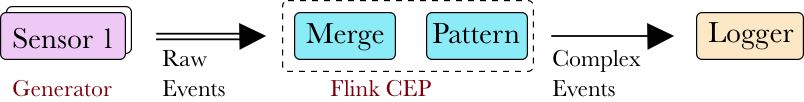

# Basic Flink Pattern

This project consist of a sensor simulator module which can simulate `N` number of streams for time `T` seconds using the uniform distribution having a upper`(UB)` and lower bound `(LB)` . The value of `T`, `(UB)` and `(LB)` can be configured separately for each sensor generator. Then these sensor steams are sent to a union operator, where the different streams are merged with one another to generate a single data stream, which is further sent to a CEP pattern consisting of various filter operators. Finally, the CEP pattern finds the complex events using the pattern shown below.
 
 The CEP pattern used is 
 `A[value > T_A] -> B[value > T_B] within T_window`
 
This pattern looks for a complex event when the value of `A` stream is above certain threshold `(T_A)` followed by value of `B` steam is above a certain threshold `(T_B)` within some time window length `T_window`. The CEP latency for each CEP event is also computed in milliseconds using the the raw event `ingestion time` and CEP event `detection time`. The  computed results are sent to a logger and appended to file at the end of simulation interval.





## Getting Started

Download the project and execute the `run` file


## Sample Output

The sample output is shown below. This this the CEP events are generated from 2 streams using a pattern. The CEP latency is also shown below.

```CEP event # 73 Ingestion Time = 1531527411769 Detection Time = 1531527411948 CEP Latency = 179 ms
   CEP event # 74 Ingestion Time = 1531527411873 Detection Time = 1531527412156 CEP Latency = 283 ms
   CEP event # 75 Ingestion Time = 1531527411976 Detection Time = 1531527412156 CEP Latency = 180 ms
   CEP event # 76 Ingestion Time = 1531527412079 Detection Time = 1531527412365 CEP Latency = 286 ms
   CEP event # 77 Ingestion Time = 1531527412183 Detection Time = 1531527412366 CEP Latency = 183 ms
   CEP event # 78 Ingestion Time = 1531527412286 Detection Time = 1531527412574 CEP Latency = 288 ms
   CEP event # 79 Ingestion Time = 1531527412390 Detection Time = 1531527412574 CEP Latency = 184 ms
   CEP event # 80 Ingestion Time = 1531527412491 Detection Time = 1531527412780 CEP Latency = 289 ms
   CEP event # 81 Ingestion Time = 1531527412595 Detection Time = 1531527412781 CEP Latency = 186 ms
   CEP event # 82 Ingestion Time = 1531527412799 Detection Time = 1531527412987 CEP Latency = 188 ms
   CEP event # 83 Ingestion Time = 1531527412904 Detection Time = 1531527413091 CEP Latency = 187 ms
   CEP event # 84 Ingestion Time = 1531527413007 Detection Time = 1531527413112 CEP Latency = 105 ms
   07/13/2018 20:16:53	Source: A stream(1/1) switched to FINISHED 
   07/13/2018 20:16:53	CEPPatternOperator -> Map(1/1) switched to FINISHED 
   07/13/2018 20:16:53	Source: B stream(1/1) switched to FINISHED 
   07/13/2018 20:16:53	Job execution switched to status FINISHED.
    
     -- System related  variables  -- 
    Input rate for stream A    = 10 events/second
   Stream A Runtime            = 10 seconds
    # raw events in stream A   = 100
   
    Input rate for stream B    = 10 events/second
   Stream B Runtime            = 10 seconds
    # raw events in stream B   = 100
   
    run Window length  = 2000 milliseconds
   
    --- Output data ---  
    Engine  Runtime                = 10.91 seconds
```

## Some important Input parameters

`input_rate_A_Sec`:  sets the input rate for A stream 

`Stream_A_RunTime_S`: sets the simulation interval for A stream

`parallelism_for_stream_A`: Parallelism for A type stream

Similarly N number of streams can be simulated each having different parameters.

`WindowLength_join__ms`: The window interval used in the CEP Pattern

`writeMode_to_file`: If yes, it will write the ouput results to file. Path needs to be changes as relative path was not working. Please set this path as the path of `org/carleton/JoinPattern/Data/out.txt`

`appendFile`: if yes, it will append the results of different experimental runs


## Author

* **Amarjit Dhillon**


## License

This project is licensed under the MIT License.